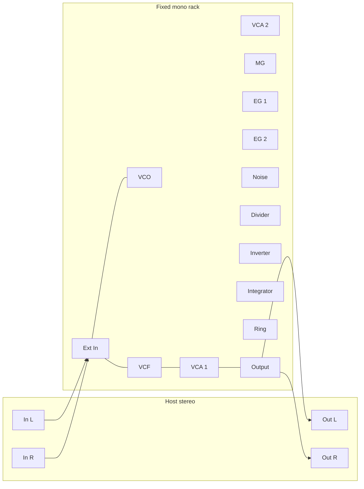

Copyright (c) 2026 Martial Systems LLC. All rights reserved.

Korg owns the MS-50, its name, and its circuit designs. This repository is an independent study of published drawings and papers. It is not a Korg product, it is not endorsed by Korg, and it does not license those designs.

# Software schematic

Date: 2026-09-21.

This is the signal path of the plugin. It is not a redraw of the Korg PCB and it does not copy the Korg drawing. Confirmed facts are cited by sheet id from `01-research.md`. Numbers that the sheets do not print use a stand-in id from `METHODOLOGY.md`.

## System

Stereo host buffers stop at the processor boundary. The graph runs in volts, one sample at a time, mono. Ext In makes the mono sum. Output turns volts back into the host's float range (S-01) and restores stereo with an explicit dry cable pair.



Lines inside the rack in that picture are not normalled connections. Only cables the user inserts, or the default patch inserts, are connections. The host boundary is not a cable.

Rack order, top to bottom, left to right:

1. Ext In, VCO, VCF, VCA 1, VCA 2, Output
2. MG, EG 1, EG 2, Noise, Ring
3. Divider, Inverter, Integrator

Phase 2 faces are not drawn and have no ports in the graph.

## PatchGraph rules

*   Fixed module list. No add-module command in phase 1.
*   Each module owns a fixed `float portValue[]`. Unpatched Audio and CV inputs are set to 0 V before the sample, except EG `Trig` jacks. An unpatched `Trig` is set to +5 V so it rests released. 0 V on a trigger means "shorted," and a missing cable must not hold the envelope forever (S-15). A Gate input that received a promoted Gate uses the promotion rule below.
*   One cable per input. A second `connect` returns false and changes nothing.
*   An output may feed several inputs (S-27). That fan-out is a software convenience so EG 1 can reach both the VCA and the filter before the multiples module exists.
*   Cable creation and deletion happen on the message thread. The audio thread reads a published snapshot.
*   Snapshot storage is two preallocated graphs plus an atomic index. Swapping snapshots does not allocate. `processBlock` does not allocate, lock, take a mutex, or log.
*   Audio thread order is a topological order computed when the snapshot is published.
*   Until step 19, a cable that would close a cycle is rejected. From step 19, a cycle is accepted: the newest cable in the cycle is the back-edge (S-24) and carries a one-sample delay. Every other cable in that snapshot is zero-delay.
*   Port types: `Audio`, `CV`, `Gate`.
*   Allowed: Audio to Audio, Audio to CV, CV to CV, CV to Audio, Gate to Gate, Gate to CV, Gate to Audio.
*   Rejected: Audio or CV into a Gate-only input. Two cables into one input. A cable from a port to itself with no module in between.
*   Gate promotion into a CV or Audio input uses S-15: held gate writes 0 V, released gate writes +5 V. That matches an active-low S-trig electrical picture. Logical "held" inside an EG still means the trigger condition is true.
*   EG `Trig` jacks are type CV, not Gate-only, because the hardware detector accepts a voltage. Ext In `Gate` is type Gate and may be patched into `Trig` through the promotion above. MG pulse is type CV (0 V to +5 V) and may be patched into `Trig` directly. Divider outputs are type CV.
*   Gate-only inputs in phase 1: none on the modules. Ext In's gate output is the Gate source. EG 2 `DelayTrig` is type Gate. Output has no gate jack.
*   Sample rate lives on the graph. `prepare(sampleRate)` runs on the message thread before audio starts, and again if the host changes rate. It may allocate. `processSample` may not.

Sketch, not a finished class:

```cpp
enum class PortType { Audio, CV, Gate };
enum class PortDir { In, Out };

struct PortDesc { const char* name; PortType type; PortDir dir; };

class Module {
public:
    virtual ~Module() = default;
    virtual int numPorts() const = 0;
    virtual PortDesc port(int index) const = 0;
    virtual void setKnob(int knob, float zeroToOne) = 0;
    virtual void prepare(double sampleRate) = 0;
    virtual void processSample() = 0; // reads and writes portValue only
    float portValue[8] {};
    double sampleRate = 48000.0;
};
```

`processSample` on a module reads `portValue` for inputs and writes `portValue` for outputs. The graph copies cable sources into destinations before each module runs. A delayed cable copies the previous sample.

## Shared formulas

Volts are the graph unit. Knob widgets store 0 to 1 and the module maps them.

Exponential time or frequency knob:

```text
value = min * pow(max / min, knob01)
```

One-pole smoother, used by VCA 2 and by the Ext In envelope:

```text
coeff = 1 - exp(-1 / (tauSeconds * sampleRate))
state += (target - state) * coeff
```

A held DC input to the integrator settles at the input. A module that ramps away on a held input is the wrong integrator.

Denormals: add nothing. If a one-pole state falls below 1e-15 V, flush it to 0. Do this inside the module, with no heap.

NaN policy: Hz/V clamps at 0.05 V (S-03). Dividers do not divide by a signal. If a state becomes non-finite, replace that state with 0 at the end of `processSample` and count it on a preallocated `uint32` for the test build only. The release audio thread does not print.

## Default patch

Cables, in creation order:

| # | From | To |
|---|---|---|
| 1 | Ext In Mono | VCF SigIn |
| 2 | VCF SigOut | VCA 1 SigIn |
| 3 | VCA 1 Out | Output Wet |
| 4 | Ext In L | Output L |
| 5 | Ext In R | Output R |
| 6 | Ext In Gate | EG 1 Trig |
| 7 | EG 1 OutA | VCA 1 Env |
| 8 | EG 1 OutA | VCF Cutoff |

Cable 8 is fan-out (S-27). Mix defaults to 1 (fully wet). A silent input does not open VCA 1, so the wet output is silent until the gate stand-in fires. That is the intended reading of a VCA with no initial gain.

## Ext In

Purpose: plugin boundary. Not an MS-50 module. Provides the stereo pair, a mono sum for the mono rack, and a gate so EG 1 can run before phase 2 TRIG SW and ESP exist.

Knobs:

| Knob | Range | Default | Status |
|---|---|---|---|
| Gate threshold | 0.05 V to 2 V on the follower | 0.2 V | S-22 |
| Gate release | 10 ms to 500 ms | 80 ms | S-22 |

The manual button is a momentary UI control, not a knob and not a module. It ORs a held gate while the mouse is down.

Jacks:

| Jack | Dir | Type | Notes |
|---|---|---|---|
| L | out | Audio | Host left, in volts: sample * 5, so a full-scale host sample is ±5 V (S-01 inverse at the input). STAND-IN input sensitivity |
| R | out | Audio | Host right, same scale |
| Mono | out | Audio | (L + R) / 2 |
| Gate | out | Gate | 1 while the button is down or the follower is above threshold |

Signal flow: host float to volts, mono sum, absolute value into a one-pole follower (attack 5 ms stand-in, release from the knob), compare to threshold.

Failure modes: full-scale stereo summing to more than ±5 V. Do not clip the mono sum in Ext In. Let the filter see it. DC from the host passes. That is acceptable.

Test: `testExtInMonoAveragesStereo`. Left +1 V-equivalent, right -1, mono 0. `testExtInGateFiresAboveThreshold`. `testExtInButtonForcesGate`.

CONFIRMED: nothing inside this block is an MS-50 circuit. STAND-IN: S-22, and the ±5 V input scaling tied to S-01.

## Output

Purpose: plugin boundary. Not the headphone amplifier.

Knobs:

| Knob | Range | Default | Status |
|---|---|---|---|
| Mix | 0 dry to 1 wet | 1 | S-23 |
| Level | 0 to 1, linear | 0.8 | S-23 |

Jacks: `L` in Audio, `R` in Audio, `Wet` in Audio. No outputs inside the graph. The processor reads the module's `outL` and `outR` after the sample.

```text
wet = Wet port (mono volts)
outL = (L * (1 - mix) + wet * mix) * level * 0.2
outR = (R * (1 - mix) + wet * mix) * level * 0.2
```

0.2 is S-01 (`kOutputVoltsToUnit`). Unpatched Wet is 0 V. Unpatched L/R are 0 V, so mix 0 with no dry cables is silence. The default patch inserts the dry cables.

Failure modes: Wet is mono, so a stereo image collapses as mix rises. That is specified. Do not build a stereo VCF to "fix" it.

Test: `testDryMixPassesStereo` at mix 0. `testWetMixIgnoresDry` at mix 1. `testLevelZeroIsSilence`.

## VCO

Purpose: one oscillator, three outputs at once. Confirmed control topology from KOD-A40044. The transistor reset and the +18 V rail are not simulated in steps 0 to 20.

Knobs:

| Knob | Range | Default | Status |
|---|---|---|---|
| Scale | 32', 16', 8', 4' | 8' | CONFIRMED positions. Hz in the table in METHODOLOGY are S-03 |
| Freq A amount | 0 to 1 | 0 | S-05 |
| Freq B amount | 0 to 1 | 0 | S-05 |
| Fine | -1 to +1, widget centered | 0 | S-04, ±2 semitones |
| PW | 0 to 1 | 0.5 | S-06 |

Jacks:

| Jack | Dir | Type |
|---|---|---|
| Hz/V | in | CV |
| Oct/V | in | CV |
| FreqA | in | CV |
| FreqB | in | CV |
| PWM | in | CV |
| Saw | out | Audio |
| Tri | out | Audio |
| Pulse | out | Audio |

Signal flow, per sample:

```text
footage = hzFor(scale)                          # S-03 table
fine = pow(2, (fineKnob * 2) / 12)              # S-04, ±2 semitones
oct = Oct/V volts + FreqA*amountA + FreqB*amountB
octExpo = pow(2, oct)                           # S-04, S-05: 1 V = 1 octave at full amount
hzFromLinear = footage * max(Hz/V volts, 0.05) / 1.0
# Scale switch changes footage and therefore the linear law only.
hz = hzFromLinear * fine * octExpo
```

When `Hz/V` is unpatched it reads 0 V, and the clamp makes the linear term `footage * 0.05`, which is too low to be the unpatched panel pitch. Correction, still a stand-in: if the Hz/V jack has no cable, the linear term is `footage` (the reference pitch). If a cable is connected, S-03 applies, including the 0.05 V floor. The graph must tell the module whether the jack is patched. Add `bool inputConnected[8]` set by the graph each sample. No allocation.

Anti-alias: PolyBLEP saw, triangle from the integrated saw, pulse by comparing the saw phase to the duty. This anti-alias method is part of S-02, not a confirmed circuit.

Duty:

```text
duty = clamp(0.05 + pwKnob * 0.90 + pwmVolts / 5 * 0.5, 0.05, 0.95)
```

Outputs: saw, triangle, and pulse each scaled to ±5 V (S-02).

Failure modes: patching a 1 V/octave keyboard into Hz/V will not play octaves. That is correct. Patching Hz/V into Oct/V will not play Korg octaves. Also correct. Do not add sync.

Test: `testScaleDoesNotChangeOctJack` (same Oct/V voltage, two scale positions, the ratio of frequencies equals the footage ratio only through the linear term; with Hz/V unpatched, changing scale changes pitch by the footage ratio). `testOctIsOneVoltPerOctave`. `testHzPerVoltIsLinear`. `testThreeOutputsAlwaysRun`. `testPwmMovesDutyNotPitch`.

CONFIRMED: two pitch jacks, scale on the linear chain, three simultaneous waves, separate PWM, no sync. STAND-IN: S-02, S-03, S-04, S-05, S-06, PolyBLEP.

## VCF

Purpose: the lowpass. Step 8 is a stable 2-pole (S-07, S-08, S-09). Step 20 replaces the cutoff computation and the feedback clip with the diode-bridge stand-in (S-10). Jacks do not change between those steps.

Knobs:

| Knob | Range | Default | Status |
|---|---|---|---|
| Cutoff | 0 to 1, exponential Hz in step 8 | 0.55 | S-07 |
| Peak | 0 to 1 | 0.15 | S-09 then S-10 |
| Cutoff amount | 0 to 1 attenuator on the CV jack | 0.4 | CONFIRMED that an attenuator exists. Depth S-08 |

Jacks: `SigIn` Audio in, `Cutoff` CV in, `SigOut` Audio out.

Step 8 flow:

```text
cv = Cutoff volts * amount          # ±5 V typical
# Positive CV raises cutoff. Map ±5 V to ±4 octaves around the knob. S-08.
hz = knobHz * pow(2, cv / 5 * 4)
hz = clamp(hz, 15, 20000)
Q = 0.5 + peak * 7.5               # S-09, Q <= 8, stable
```

Transposed direct form II biquad, lowpass, `w0 = 2*pi*hz/sampleRate`, `alpha = sin(w0)/(2Q)`. Flush denormals. AC character: step 8 may pass DC. Step 20 adds a one-pole highpass at 5 Hz in front of the output as a stand-in for the output coupling capacitor. Mark that highpass S-10b in the code comment next to S-10.

Step 20 additions, still not a WDF and not a claim of measured CA3019 parameters:

*   Compute a control current from cutoff and CV using the paper's shape `Ib = Is * (exp(vBias / (n*VT)) - 1)` with S-10's Is and n. Map `Ib` to the two resistances of the linearized bridge the way the paper reduces the bridge to two resistors, using a precomputed function of bias, not a runtime matrix allocate.
*   Run the 2-pole with those resistances.
*   Apply `tanh` in the feedback path as the stand-in for D5 to D12.
*   A larger `|SigIn|` may reduce the effective bias slightly so cutoff and resonance fall. The coefficient of that pull is S-10 and starts small enough that a -12 dBFS saw does not mute the filter. Do not encode 250 Hz or 200 Hz.

Failure modes: Q above 8 in step 8. Hard-coded self-oscillation frequency. Using a Korg-35 or OTA formula. A highpass mode (that is the AM8319, not this sheet).

Test step 8: `testVcfPassesDcOrLow` (a 30 Hz sine is louder than a 15 kHz sine at low cutoff). `testVcfPeakIncreasesResonance` (ring longer at peak 1 than peak 0, and the output stays finite). `testVcfPositiveCvRaisesCutoff`.

Test step 20: `testVcfStaysFiniteWhenDrivenHard`. `testVcfHotInputMovesSpectrum` (a loud input and a quiet input do not produce the same normalized spectrum at high peak). `testVcfHasNoHighpassSwitch`.

CONFIRMED: 2-pole lowpass, CA3019 bridge as the target, peak knob, cutoff attenuator, clipper diodes exist, output coupling exists, not keyboard-tracked by a printed law. STAND-IN: S-07, S-08, S-09, S-10.

## VCA 1

Purpose: audio VCA, sheet name VCA. Linear gain is S-11 until a later pass replaces it with a diode-bridge gain. Low-cut stays manual.

Knobs:

| Knob | Range | Default | Status |
|---|---|---|---|
| Low cut | 10 Hz to 2 kHz, exponential | 10 Hz | S-11. The control exists: CONFIRMED |
| Intensity | 0 to 1 | 0.85 | CONFIRMED as an output attenuator. The taper is linear stand-in |

Jacks: `SigIn` Audio in, `Env` CV in, `Out` Audio out.

```text
envGain = clamp(Env volts / 5, 0, 1)     # negative env closes. S-11
filtered = onePoleHighpass(SigIn, lowCutHz)
Out = filtered * envGain * intensity
```

No initial gain. Unpatched Env is 0 V, so the output is 0. AC coupling stand-in: the low-cut at its minimum (10 Hz) is the only highpass. Do not add a second DC block.

Failure modes: treating Intensity as a CV-depth knob. A CV jack on low-cut. Sharing this code path with VCA 2.

Test: `testVca1SilentWithoutEnv`. `testVca1IntensityScalesOutput`. `testVca1LowCutDarkens` (high low-cut reduces a 40 Hz sine and leaves a 2 kHz sine). `testVca1NegativeEnvIsClosed`.

CONFIRMED: manual low-cut, intensity after the gain cell, env jack, AC-coupled role. STAND-IN: S-11 linear gain.

## VCA 2

Purpose: modulation VCA, sheet name MVCA. DC-coupled. Opto lag is a smoother (S-12).

Knobs: none.

Jacks: `In` CV in (also accepts Audio), `Control` CV in, `Out` CV out.

```text
target = clamp(Control volts / 5, 0, 1)
gain = onePole(target, tau = 0.020)      # S-12
Out = In * gain
```

A DC input of +3 V with control +5 V settles near +3 V. A pulse on Control does not pass instantly. 20 ms is the stand-in, not a measurement.

Failure modes: AC coupling. A panel knob that the sheet does not have. Reusing VCA 1's low-cut.

Test: `testVca2PassesDc`. `testVca2ControlDoesNotClick` (a step on Control produces a ramp longer than one sample). `testVca2NoKnobs`.

CONFIRMED: opto topology, DC path, no panel knob. STAND-IN: S-12.

## MG

Purpose: modulation generator. UI title `MG`. Class name `MgModule`. Do not label the faceplate only "LFO".

Knobs:

| Knob | Range | Default | Status |
|---|---|---|---|
| Frequency | 0.01 Hz to 200 Hz, exponential knob | 5 Hz | Endpoints CONFIRMED. Taper S-16 |
| PW | 0 to 1 | 0.5 | One knob drives symmetry and pulse width. CONFIRMED wiring. Map S-16 |

Jacks: `FreqMod` CV in, `PWM` CV in, `Tri` Audio out, `SawUp` Audio out, `SawDown` Audio out, `Pulse` Audio out.

There is no FM amount knob on the MG sheet, only the jack. Stand-in depth, still S-16: a FreqMod voltage shifts frequency in hertz, not in octaves (that linear reading is INFERRED).

```text
hz = clamp(knobHz + (FreqMod volts / 5) * knobHz, 0.01, 200)
```

Full-scale +5 V doubles the knob frequency. Full-scale -5 V reaches the 0.01 Hz clamp when the knob is the only other term. Call the scale factor out in a comment on the S-16 constants. Do not add an FM-amount knob.

```text
sym = clamp(pwKnob + pwmVolts / 5, 0, 1)
```

`sym` 0: falling saw on the triangle output's shape, pulse duty 0.05. `sym` 0.5: triangle, duty 0.5. `sym` 1: rising saw, duty 0.95. The dedicated saw jacks always output the two slopes at ±2.5 V, so a patch can pick a saw without turning PW. Pulse is 0 V to +5 V, never negative. Triangle and saws are ±2.5 V. Those levels are CONFIRMED.

Failure modes: a bipolar pulse. A frequency knob that stops at 20 Hz. Separate knobs for symmetry and width.

Test: `testMgPulseIsUnipolar`. `testMgTriangleIsBipolar2V5`. `testMgFreqEndpoints`. `testMgPwAffectsPulseAndTriangle`. `testMgSawJacksOpposite`.

## EG 1

Purpose: ADSR. Three outputs.

Knobs: Attack, Decay, Sustain, Release. Times S-13, 1 ms to 10 s exponential. Sustain 0 to 1. Defaults: A 0.01 s, D 0.25 s, S 0.6, R 0.30 s. Map the 0 to 1 widgets with S-13.

Jacks: `Trig` CV in, `OutA` CV out, `OutB` CV out, `OutC` CV out.

Trigger: held while `Trig volts < 1.5` (S-15). Unpatched, the graph writes +5 V and the envelope stays idle. A promoted Gate writes 0 V when held, so Ext In Gate opens the EG, and writes +5 V when released. Rising edge (released to held) restarts attack. While held after decay, output sits at sustain. Release starts when the input goes above 1.5 V. Retrigger from a new edge during release restarts attack from the current level (no forced drop to 0). That edge rule is part of S-15.

Shapes, exponential segments toward the target (RC stand-in, S-13):

```text
OutA: 0 V idle, up to +5 V, down to sustain*5 V, release toward 0 V
OutB: negation of OutA
OutC: OutA - sustain*5 V, so a sustain of 0.5 sits at 0 V and the peak is +5 V only when sustain is 0
```

OutC's centering is S-14 and is the first EG1 voltage to replace if a manual turns up. OutA and OutB's 5 V span is also S-14, chosen to match the EG2 cartoons.

Failure modes: one output. MS-20 EG1 timing (delay then attack then release) on this module. A sustain that is a time rather than a level.

Test: `testEg1SustainLevel`. `testEg1OutBIsNegation`. `testEg1ReleasesWhenTriggerLifts`. `testEg1HasDecay`. `testEg1ThreeJacks`. `testEg1UnpatchedTrigIsIdle` (no cable, Trig forced to +5 V, envelope stays at 0).

CONFIRMED: four ADSR knobs, three jacks, one trig. STAND-IN: S-13, S-14, S-15.

## EG 2

Purpose: hold, delay, attack, release. No decay knob. No sustain knob. No sustain plateau in the stand-in.

Knobs: Hold, Delay, Attack, Release. All S-13, 1 ms to 10 s. Defaults: hold 1 ms, delay 1 ms, attack 0.02 s, release 0.20 s.

Jacks: `Trig` CV in (same 1.5 V rule, S-15), `OutPos` CV out, `OutNeg` CV out, `DelayTrig` Gate out.

S-26 timeline, which is the implementable spec:

1. On the edge into "held," set phase to Wait and clear the envelope to 0 V.
2. Wait for `holdSeconds + delaySeconds`. The envelope stays at 0 V. This is the stand-in. A later measurement may show that hold instead stretches a plateau.
3. At the end of the delay portion (time == holdSeconds), `DelayTrig` is high for one sample on the Gate output. The remaining wait is the rest of delay. If delay is at minimum, the pulse is at the end of hold.
4. Attack: rise from 0 V to +5 V in attack seconds.
5. Release starts as soon as attack finishes. Fall to 0 V. There is no flat top.
6. `OutNeg = -OutPos`.
7. A new edge during the cycle restarts at step 1.

`DelayTrig` is a Gate: high for that single sample, low otherwise. It can be patched into EG 1 `Trig` via Gate-to-CV promotion (writes 0 V for that sample, which is "held" under S-15). One sample may be too short for a detector that looks at edges if the edge requires two samples. Implementation rule: hold `DelayTrig` high for `max(1, round(0.001 * sampleRate))` samples (1 ms). That width is part of S-26.

Failure modes: adding Decay or Sustain knobs. Copying EG 1. A plateau at +5 V while the gate is held.

Test: `testEg2HasNoSustainKnob`. `testEg2ReturnsToZeroWithoutAPlateau`. `testEg2DelayTrigAfterHold`. `testEg2NegIsNegation`. `testEg2Restart`.

CONFIRMED: four knobs, no decay, no sustain, two opposite 5 V cartoons, delay trig jack exists. STAND-IN: S-26 timeline, S-13 times, 1 ms pulse width.

## Noise

Purpose: white and pink. No panel knob. KOD-A40042.

Jacks: `White` Audio out, `Pink` Audio out.

White: xorshift32 inside the module, summed three-uniform approximation, scaled to about ±2.5 V peak (S-17). Pink: Paul Kellett filter on that white noise, then the same peak scale. Seed is `0xA341316C` at `prepare`, so tests are repeatable. Do not call `rand()`.

The selected transistor and the internal trim are not controls. Do not add a level knob.

Failure modes: a panel level. Pink that is only a one-pole lowpass with no 3 dB/octave attempt. Allocating a noise buffer.

Test: `testNoiseBothJacksMove`. `testNoiseSeedRepeats`. `testNoisePinkIsDarkerThanWhite` (integrated absolute slope, or a Goertzel at 100 Hz versus 10 kHz: pink has a smaller high/low ratio than white). `testNoiseHasNoKnobs`.

CONFIRMED: two outputs, no panel knob, pink is filtered white. STAND-IN: S-17 spectrum and level.

## Divider

Purpose: clock divider. ÷2 and ÷4 only. KOD-A40041.

Knobs: none.

Jacks: `In` CV in (Audio may be patched in), `Div2` CV out, `Div4` CV out.

Schmitt (S-18): go high when input crosses +0.5 V upward, go low when it crosses +0.3 V downward. On each rising output of the Schmitt, toggle div2. On each rising edge of div2, toggle div4. High level +5 V, low level 0 V.

An input that never crosses the window produces constant lows. A bipolar triangle of ±2.5 V at audio rate does cross it. A tiny CV around 0.1 V does not. That matches the research note that a small CV will not clock the comparator.

Failure modes: a ÷8 output. Sine sub-oscillators. A frequency knob.

Test: `testDividerOnlyTwoAndFour`. `testDividerSquareCounts` (100 rising edges in, 50 rising edges on div2, 25 on div4). `testDividerIgnoresTinySignal`.

CONFIRMED: ÷2, ÷4, comparator front end. STAND-IN: S-18.

## Inverter

Purpose: gain -1. KOD-A40043. DC-coupled.

Knobs: none. Do not expose the internal offset trim (S-19 forces offset 0).

Jacks: `In` CV in, `Out` CV out.

```text
Out = -In
```

Test: `testInverterNegatesDc`. `testInverterNegatesAudio`. `testInverterHasNoKnobs`.

CONFIRMED: unity inversion, DC path, no panel offset. STAND-IN: S-19 zero offset.

## Integrator

Purpose: lag. Faceplate title `Integrator`. It stays a module. KOD-A40039.

Knobs:

| Knob | Range | Default | Status |
|---|---|---|---|
| Time | 1 ms to 2 s, exponential tau | 50 ms | S-20 |

Jacks: `In` CV in, `Out` CV out.

```text
coeff = 1 - exp(-1 / (tau * sampleRate))
state += (In - state) * coeff
Out = state
```

Same sign. A constant +4 V input ends at +4 V. A fast Time dulls audio. A slow Time glides pitch when patched into Oct/V. It does not resonate and it does not run away.

Failure modes: hiding this inside the VCO as "glide." A free integrator. A resonant filter.

Test: `testIntegratorSettlesToInput`. `testIntegratorSameSign`. `testIntegratorSlowIsSlower`. `testIntegratorIsItsOwnModule` (the rack list contains it).

CONFIRMED: IN, TIME, OUT, lag behavior rather than a runaway ramp. STAND-IN: S-20 tau range and the one-pole shape.

## Ring

Purpose: four-quadrant multiplier, RC4200 on KOD-A40040. Not the filter diodes.

Knobs: none. Bleed constant is 0 (S-21). Do not add a panel null.

Jacks: `A` CV in, `B` CV in, `Out` CV out. Audio may be patched to A or B.

```text
Out = (A * B) / 5 + bleed
bleed = 0
```

+5 V and +5 V produce +5 V. +5 V and -5 V produce -5 V. Either input at 0 V produces 0 V. DC passes, so an envelope on B and audio on A is a VCA.

Failure modes: a diode-ring model shared with the VCF. AC coupling. A panel knob.

Test: `testRingFourQuadrant`. `testRingZeroKills`. `testRingPassesDcProduct`. `testRingHasNoKnobs`.

CONFIRMED: four-quadrant IC, two inputs, one output, no panel knob, DC path. STAND-IN: S-21 scale and zero bleed.

## Phase 2 faces (documented, no ports)

Do not instantiate these in `ModuleRack`.

*   Adding amp: three attenuators, inverting mix, DC. Needed later if fan-out (S-27) is removed.
*   Sample and hold: IN, OUT, EXT CLOCK, CLOCK OUT, rate pot. FET hold. Not a stand-in inside Noise.
*   ESP: preamp, follower, trigger. Not the Ext In gate (S-22), which must be deleted or relabeled when ESP exists.
*   TRIG SW: active-low button module. Replaces the Ext In manual button's role as the obvious trigger.
*   Volt source, meter, headphone amp: as in the research summary.
*   Multiples: do not invent buffering. The sheet set does not show the circuit.

## State

Step 18 stores: format version, sample-rate-independent knob values (0 to 1 or the scale index), and the cable list as module-id plus port-index pairs. It does not store module state (EG phase, filter memory, noise seed). Loading a preset calls `prepare` memory clear. Unknown version: reject the load, keep the current patch, report an error on the message thread.

## What the audio thread is forbidden to do

Allocate, lock, read the message-thread cable vector, call into JUCE, resize a buffer, build a path for a cable, or walk the module list in UI order if that differs from the published topological order.
