# RONIN User Manual

**Semi-modular synthesizer and effect · Jidai Collection · Martial Systems**

---

## Contents

1. Overview
2. Quick start
3. Panel reference
4. Patching
5. MIDI and host sync
6. Factory programs by bank
7. DAW setup
8. Specs
9. Troubleshooting
10. Legal

Back Panel Patching (RONIN in the JIDAI RACK)

---

## 1. Overview

RONIN puts a whole analog-style rack inside one plugin. Run your track through it, or let it make its own sound. It has sixteen sections, all wired with patch cables you drag across the panel:

- **VCO** with saw, triangle and pulse outputs, a footage switch (32', 16', 8', 4'), fine tune, pulse width, two FM inputs, a 1 V/oct input and a linear Hz/V input.
- **VCF**, a resonant two-pole lowpass that self-oscillates. An input-level pull lets hot signals darken the filter. Its response is the same at every sample rate.
- **VCA 1**, an AC-coupled amplifier with a LOW CUT control, and **VCA 2**, an opto-style amplifier with a smooth lag.
- **EG 1** (attack, decay, sustain, release) and **EG 2** (hold, delay, attack, release), with S-trig inputs. Every time knob shows the real duration.
- **MG**, an LFO from 0.01 Hz to 200 Hz with a morphing triangle, saw, inverted saw and pulse.
- **NOISE** (white and pink), **S&H** (sample and hold), **RING** (ring modulator), **DIV** (÷2 and ÷4), **INV** (inverter), **INT** (integrator, for slew and slide) and a three-input inverting **MIX**.
- **EXT IN**, which turns your track into signals: left, right, a mono sum and a gate. **OUTPUT** blends the patch back in with your dry signal.

Every feedback loop is delayed by exactly one sample, so self-patching stays stable and sounds the same every time.

RONIN runs as a VST3 effect and as a device in the JIDAI RACK, where its jacks patch into the other Jidai devices (see Back Panel Patching).

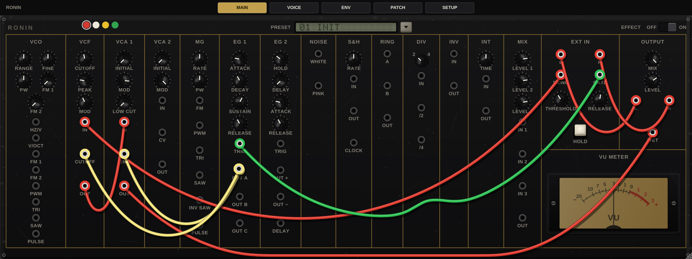

---

## 2. Quick start

1. Install the plugin (section 7) and insert RONIN as an effect on an audio track or bus.
2. RONIN opens on **01 INIT**. Your track runs through the VCF and VCA 1. When the input crosses the EXT IN threshold, EG 1 opens the VCA and moves the filter.
3. Hold the **HOLD** key to open the EXT IN gate by hand.
4. Click the **PRESET** screen and choose **08 ACID LINE**. RONIN now plays an acid bass line on its own, with no input needed.
5. Drag from any jack to another to patch. Drop a plug on empty space to unplug it.
6. Use **MIX** (OUTPUT) to blend the patch with your dry signal, and the **EFFECT** switch to go back to dry.

---

## 3. Panel reference

### 3.1 Using the controls

| Action | What it does |
|---|---|
| **Drag** a knob up or down | Turns it. 200 pixels of travel cover the full range. |
| **Shift-drag** a knob | Fine adjustment, five times finer. |
| **Mouse wheel** | Small steps. Hold Shift for smaller steps. |
| **Double-click** a knob | Resets it to its default. |
| **Hover** over a knob or jack | Shows its real value: Hz, note and cents, seconds, volts or percent. |
| **Right-click** a knob | Type a value. RONIN reads what it shows: `1.07 kHz`, `621 ms`, `2.5 s`, `+34 c`, `Q 4`, `3 V`, `58 %` or `8'`. A bare number uses the knob's own unit. |
| **Click** the DIV switch | Toggles between /2 and /4. |
| **Right-click** a list or selector | Opens the whole list with the current item ticked (the DIV switch, the PRESET screen, the selectors on the tabs). |
| **Shift-click** a list control | Steps back one item; a plain click steps forward. |

Every knob is a host parameter, so your DAW can automate it. Knobs move without zipper noise.

### 3.2 Tabs and header

The tab strip at the top switches between **MAIN** (the panel), **VOICE**, **ENV**, **PATCH**, **MIDI** and **SETUP**.

| Control | What it does |
|---|---|
| **Colour swatches** (red, white, yellow, green) | The colour for new cables when SETUP › CABLE COLOUR is MANUAL. |
| **PRESET** screen | Shows the current program. Click it to open the list of all 22 programs in two columns. Up and down move through the list, left and right jump between columns, Enter loads, Esc closes. |
| **EFFECT** rocker | Left is **OFF**: the dry signal on OUTPUT L and R passes and MIX is not used. Right is **ON**: you hear the MIX blend of dry and WET. The patch keeps running either way and OUTPUT LEVEL still applies. |
| **VU METER** | Reads the jack you last clicked, with ±5 V as full scale. |

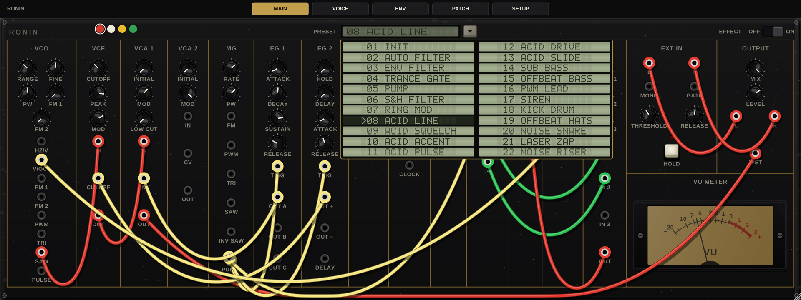

Loading a program replaces all cables, resets every knob to its default and then sets the program's own knobs.

### 3.3 MAIN page: the modules

The panel reads left to right. Knob ranges and defaults are below, in the units the hover readout shows.

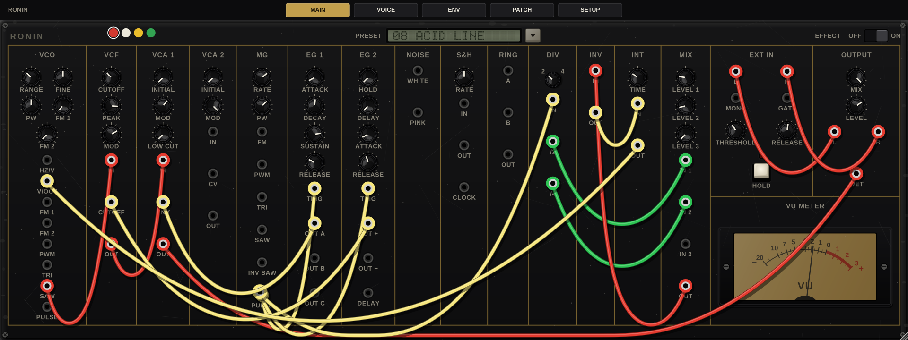

| Section | Control | Range | Default |
|---|---|---|---|
| VCO | RANGE | 32', 16', 8', 4' (0 V plays C1, C2, C3, C4) | 8' |
| VCO | FINE | −200 to +200 cents | 0 c |
| VCO | PW | Pulse duty 5 % to 95 % | 50 % |
| VCO | FM 1, FM 2 | Amount for the FM 1 and FM 2 jacks. Full turn: 1 V moves the pitch one octave. | 0 |
| VCF | CUTOFF | 20 Hz to 18 kHz | 427 Hz |
| VCF | PEAK | Resonance, Q 0.5 to 8 | Q 2.00 |
| VCF | MOD | Amount for the CUTOFF jack, 0 to 4 octaves per 5 V | 1.60 oct / 5 V |
| VCA 1 | INITIAL | Gain with no ENV signal, 0 to 100 % | 0 % |
| VCA 1 | MOD | Overall gain, 0 to 100 % | 85 % |
| VCA 1 | LOW CUT | Low-cut corner, 10 Hz to 2 kHz | 10 Hz |
| VCA 2 | INITIAL | Gain with no CV, 0 to 100 % | 0 % |
| VCA 2 | MOD | Overall gain, 0 to 100 % | 100 % |
| MG | RATE | 0.01 Hz to 200 Hz | 1.41 Hz |
| MG | PW | Shape of TRI and duty of PULSE | 50 % |
| EG 1 | ATTACK, DECAY, RELEASE | 1 ms to 60 s | 9.85 ms, 73 ms, 73 ms |
| EG 1 | SUSTAIN | 0 V to 5 V | 3.00 V |
| EG 2 | HOLD, DELAY | 1 ms to 10 s | 15.8 ms, 1 ms |
| EG 2 | ATTACK, RELEASE | 1 ms to 60 s | 9.85 ms, 73 ms |
| S&H | RATE | Internal clock, 0.1 Hz to 100 Hz | 3.16 Hz |
| DIV | Switch | /2 or /4 | /2 |
| INT | TIME | 1 ms to 2 s | 44.7 ms |
| MIX | LEVEL 1, 2, 3 | 0 to 100 % per input | 80 % |
| EXT IN | THRESHOLD | Gate threshold, 0.05 V to 2 V | 0.200 V |
| EXT IN | RELEASE | Gate release, 10 ms to 500 ms | 80 ms |
| OUTPUT | MIX | 0 (dry) to 100 % (patch) | 100 % |
| OUTPUT | LEVEL | 0 (silent), 70 % (unity) to 100 % (+6 dB) | 70 % |

**VCO.** RANGE picks the octave. A RANGE change takes effect at the start of the next cycle, so it never clicks. V/OCT adds 1 V per octave. HZ/V is a linear input: with a cable in it, the pitch is the footage frequency times the input voltage (1 V plays C3 at 8'; voltages below 0.05 V are held at 0.05 V). FM 1 and FM 2 add octaves (volts × knob amount). PWM adds to the PW knob: +5 V adds 50 % duty. The triangle shape is set on the VOICE page.

**VCF.** CUTOFF and the CUTOFF jack (scaled by MOD) set the corner. At high PEAK settings it self-oscillates. The VOICE page shows the live cutoff after the input pull.

**VCA 1.** Gain = (ENV ÷ 5 V + INITIAL), held between 0 and 1, times MOD. With INITIAL at 0, nothing passes until a signal arrives at ENV. LOW CUT is the corner of its AC coupling.

**VCA 2.** The same gain law on its CV jack, with a 20 ms lag for an opto-style feel. It passes DC, so it can scale control voltages as well as audio.

**MG.** TRI morphs with PW: a falling saw at one end, a triangle in the middle, a rising saw at the other end. SAW and INV SAW are opposite ramps. PULSE is a 0/5 V square whose duty follows PW from 5 % to 95 %. The FM jack changes the rate: +5 V doubles it, and negative voltages slow it down to the bottom of its range. The PWM jack adds to PW.

**EG 1.** An S-trig input fires the attack, and the envelope holds at SUSTAIN while the trigger is held. RELEASE runs when it lets go. A new trigger restarts the attack from the current level. ATTACK is the time to reach 5 V. DECAY and RELEASE are the times to get within 1 % of their target. OUT A is the envelope (0 to +5 V), OUT B is its negative, and OUT C is the envelope minus the sustain level.

**EG 2.** Each trigger restarts EG 2 from 0 V. It waits for HOLD and then DELAY, rises over ATTACK to 5 V and falls straight away over RELEASE. It plays through the whole shape however short the trigger is. At the end of HOLD, the DELAY jack sends a 5 V pulse of at least 1 ms. OUT + is the envelope (0 to +5 V) and OUT − is its negative.

**NOISE.** WHITE peaks at ±2.5 V. PINK is darker.

**S&H.** On each clock it samples IN and holds it at OUT. Without a cable in CLOCK, the RATE knob clocks it. With a cable in CLOCK, that signal clocks it on each rising edge.

**RING.** OUT = A × B ÷ 5 V. Both inputs pass DC, so it works on control voltages too.

**DIV.** Counts rising edges at IN. /2 and /4 are 0/5 V square waves at a half and a quarter of the input rate. Both outputs always run. The switch position is saved with the patch.

**INV.** OUT is IN turned upside down (OUT = −IN).

**INT.** Smooths IN with a one-pole lag set by TIME. Use it for slide (portamento) on pitch or to soften gate edges.

**MIX.** Sums IN 1–3, each scaled by its LEVEL, and inverts the result: OUT = −(IN 1 × LEVEL 1 + IN 2 × LEVEL 2 + IN 3 × LEVEL 3). Patch MIX OUT through INV for a non-inverted sum.

**EXT IN.** L and R are your track, MONO is (L + R) ÷ 2, and GATE follows the input level. A level follower rises in 5 ms and falls at the speed set by RELEASE. The gate opens when the level passes THRESHOLD and closes when it falls below 70 % of THRESHOLD, so it opens and closes cleanly, even on bass. The **HOLD** key keeps the gate open while you hold it.

**OUTPUT.** L and R are the dry path, and WET is the patch. With EFFECT on, each side is dry × (1 − MIX) + WET × MIX, then LEVEL.

### 3.4 VOICE page

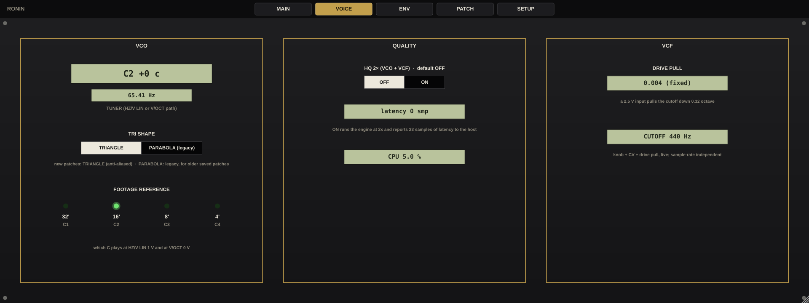

| Item | What it shows or does |
|---|---|
| **TUNER** | The VCO's pitch as note and cents, and in Hz. C3 is 130.81 Hz. |
| **TRI SHAPE** | **TRIANGLE**: a band-limited triangle with only odd harmonics, used by new patches and every factory program. **PARABOLA (legacy)**: the rounder shape of earlier RONIN versions, which older projects load on. |
| **FOOTAGE REFERENCE** | Lamps for 32', 16', 8' and 4', and which C each one plays at 0 V on V/OCT (or 1 V on HZ/V). |
| **QUALITY: HQ 2× (VCO + VCF)** | OFF (default) or ON. ON runs the VCO and VCF at twice the sample rate for less aliasing and reports 23 samples of latency to your host. The page shows the latency (0 or 23 samples) and RONIN's CPU load. |
| **DRIVE PULL** | How much a hot input pulls the cutoff down. It is fixed: a 2.5 V input pulls the cutoff down by 0.32 octave. |
| **CUTOFF** | The live cutoff, from the knob, the CUTOFF jack and the drive pull together. |

### 3.5 ENV page

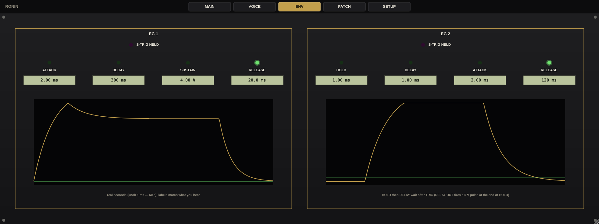

Both envelopes side by side. A lamp lights for each stage while it runs, and the **S-TRIG HELD** lamp lights while the trigger input is held. The readouts show each knob's real value, and the curve shows the envelope's shape.

### 3.6 PATCH page

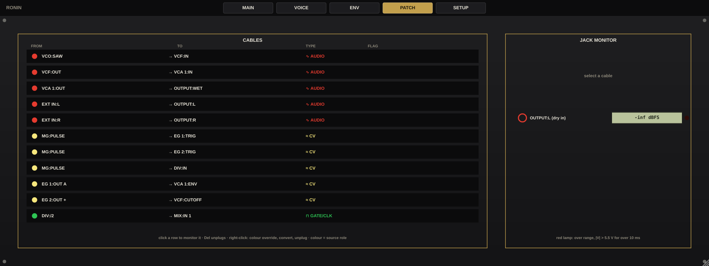

| Item | What it does |
|---|---|
| **CABLES** list | Every cable: FROM, TO, its signal TYPE and any FLAG. Click a row to monitor it. **Delete** unplugs the selected cable. Right-click a row to change its colour, convert it or unplug it. |
| **JACK MONITOR** | The level of the monitored jack in dBFS. A red lamp lights when the jack goes beyond ±5.5 V for more than 10 ms. |

### 3.7 SETUP page

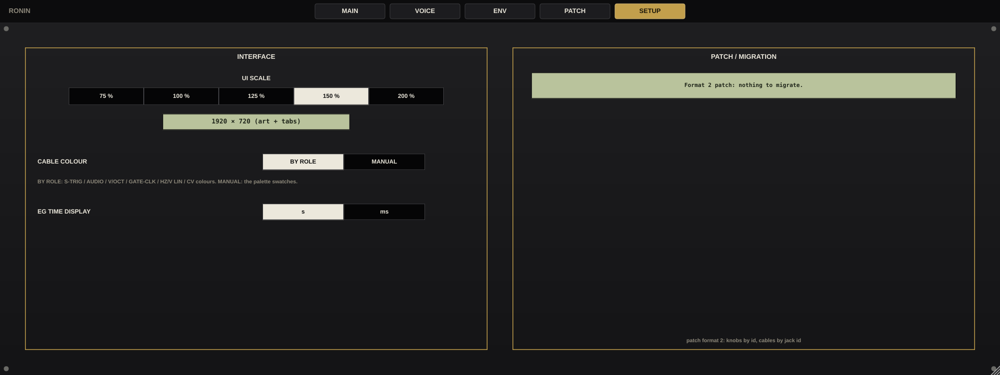

| Item | What it does |
|---|---|
| **UI SCALE** | 75 %, 100 %, 125 %, 150 % or 200 %. At 100 % the window is 1280 × 480. The size readout shows the current window. |
| **CABLE COLOUR** | **BY ROLE** (default): each cable takes the colour of its source's signal type (section 4). **MANUAL**: new cables take the colour of the swatch you picked. |
| **EG TIME DISPLAY** | Show envelope times in seconds (**s**) or always in milliseconds (**ms**). |
| **PATCH / MIGRATION** | When an older RONIN project loads, this lists what was updated to keep it sounding the same. |

---

## 4. Patching

### 4.1 Making cables

- **Drag** from an empty jack to another jack to make a cable. Cables always run from an output to an input.
- **Drag a plug** to move that end of the cable. Drop it on empty space to unplug it.
- **Shift-drag** from a patched jack to stack another cable on it.
- **Click** a jack to choose a cable from its stack. The VU meter then reads that jack.
- **Right-click** a cable to remove it.
- RONIN holds up to 64 cables.

### 4.2 How signals combine

- One output can feed any number of inputs.
- Several cables into one input are added together.
- Feedback is allowed. When cables form a loop, the newest cable in the loop is delayed by exactly one sample.

### 4.3 Levels

RONIN works in volts. Full scale is ±5 V, which is ±1.0 (0 dBFS) in your DAW.

| Signal | Level |
|---|---|
| Audio | ±5 V = full scale |
| Pitch, V/OCT | 1 V per octave. 0 V plays C3 (130.81 Hz) at 8'. |
| Pitch, HZ/V | Linear. 1 V plays C3 at 8', 2 V an octave higher. |
| Gate and clock | 0 V off, 5 V on. Inputs read on above 1.0 V and off below 0.5 V. |
| S-trig (EG 1 and EG 2 TRIG) | Held below 1.0 V, released above 1.5 V. An unpatched TRIG rests at 5 V (released). |
| CV | Modulation voltages, mostly within ±5 V |

**S-trig.** The envelope TRIG inputs fire when the voltage drops below 1.0 V, the opposite of a gate. EXT IN GATE already sends this kind of signal: 0 V while the gate is open and 5 V when it is closed. A cable from a gate output, such as EG 2 DELAY or a sequencer gate in the JIDAI RACK, is converted for you, so the envelope fires while the gate is high. Other signals, such as MG PULSE or DIV, arrive as they are: the envelope fires while they are low.

### 4.4 Cable colours

With CABLE COLOUR set to BY ROLE, a cable takes the colour of its source jack's role:

| Colour | Role |
|---|---|
| Red | Audio |
| Blue | V/OCT pitch |
| Light blue | HZ/V linear pitch |
| Green | Gate / clock |
| Yellow | CV |
| Purple | S-trig |

### 4.5 Jack reference

All 57 jacks on the panel, then the four MIDI jacks. "In" is an input and "Out" an output.

| Section | Jack | In/Out | Role | Level and behaviour |
|---|---|---|---|---|
| VCO | HZ/V | In | HZ/V pitch | Linear: pitch = footage frequency × volts. 1 V = C3 at 8'. Held at 0.05 V or more. |
| VCO | V/OCT | In | V/OCT pitch | 1 V/oct. 0 V = C3 at 8'. |
| VCO | FM 1 | In | CV | Volts × FM 1 knob, in octaves |
| VCO | FM 2 | In | CV | Volts × FM 2 knob, in octaves |
| VCO | PWM | In | CV | +5 V adds 50 % duty. Duty stays within 5–95 %. |
| VCO | TRI | Out | Audio | ±5 V |
| VCO | SAW | Out | Audio | ±5 V |
| VCO | PULSE | Out | Audio | ±5 V |
| VCF | IN | In | Audio | ±5 V nominal. Hotter signals pull the cutoff down. |
| VCF | CUTOFF | In | CV | Scaled by MOD, 0 to 4 octaves per 5 V |
| VCF | OUT | Out | Audio | ±5 V nominal |
| VCA 1 | IN | In | Audio | ±5 V |
| VCA 1 | ENV | In | CV | 0 to +5 V = closed to fully open (with INITIAL 0) |
| VCA 1 | OUT | Out | Audio | AC-coupled (LOW CUT) |
| VCA 2 | IN | In | CV | Any signal. DC passes. |
| VCA 2 | CV | In | CV | 0 to +5 V = closed to fully open (with INITIAL 0), 20 ms lag |
| VCA 2 | OUT | Out | CV | IN × gain |
| MG | FM | In | CV | Rate × (1 + V ÷ 5 V) |
| MG | PWM | In | CV | +5 V adds 100 % to PW |
| MG | TRI | Out | CV | ±2.5 V, shape follows PW |
| MG | SAW | Out | CV | ±2.5 V |
| MG | INV SAW | Out | CV | ±2.5 V, the opposite ramp |
| MG | PULSE | Out | CV | 0/5 V, duty 5–95 % |
| EG 1 | TRIG | In | S-trig | Held below 1.0 V, released above 1.5 V |
| EG 1 | OUT A | Out | CV | 0 to +5 V |
| EG 1 | OUT B | Out | CV | 0 to −5 V (OUT A inverted) |
| EG 1 | OUT C | Out | CV | OUT A minus the sustain level |
| EG 2 | TRIG | In | S-trig | Held below 1.0 V, released above 1.5 V |
| EG 2 | OUT + | Out | CV | 0 to +5 V |
| EG 2 | OUT − | Out | CV | 0 to −5 V |
| EG 2 | DELAY | Out | Gate | 5 V pulse (at least 1 ms) at the end of HOLD |
| NOISE | WHITE | Out | Audio | Peaks at ±2.5 V |
| NOISE | PINK | Out | Audio | Darker than WHITE |
| S&H | IN | In | Audio | Any signal |
| S&H | OUT | Out | CV | The held voltage |
| S&H | CLOCK | In | Gate / clock | Samples on each rising edge (on above 1.0 V, off below 0.5 V). Replaces the RATE clock. |
| RING | A | In | CV | Any signal, DC passes |
| RING | B | In | CV | Any signal, DC passes |
| RING | OUT | Out | CV | A × B ÷ 5 V |
| DIV | IN | In | Gate / clock | Rising edges counted (on above 1.0 V, off below 0.5 V) |
| DIV | /2 | Out | Gate / clock | 0/5 V at half the input rate |
| DIV | /4 | Out | Gate / clock | 0/5 V at a quarter of the input rate |
| INV | IN | In | CV | Any signal |
| INV | OUT | Out | CV | −IN |
| INT | IN | In | CV | Any signal |
| INT | OUT | Out | CV | IN smoothed by TIME |
| MIX | IN 1 | In | Audio | Scaled by LEVEL 1 |
| MIX | IN 2 | In | Audio | Scaled by LEVEL 2 |
| MIX | IN 3 | In | Audio | Scaled by LEVEL 3 |
| MIX | OUT | Out | Audio | −(sum of the scaled inputs) |
| EXT IN | L | Out | Audio | Your track's left channel, full scale = ±5 V |
| EXT IN | R | Out | Audio | Your track's right channel |
| EXT IN | MONO | Out | Audio | (L + R) ÷ 2 |
| EXT IN | GATE | Out | S-trig | 0 V while the gate is open, 5 V while it is closed |
| OUTPUT | L | In | Audio | Dry left |
| OUTPUT | R | In | Audio | Dry right |
| OUTPUT | WET | In | Audio | The patch, to both sides |
| MIDI | NOTE | Out | V/OCT pitch | From MIDI notes, patched on the MIDI tab. 1 V/oct, C3 (MIDI 48) = 0 V. Holds after release. |
| MIDI | HZ/V LIN | Out | HZ/V pitch | The same note, linear: C3 = 1 V |
| MIDI | GATE | Out | Gate / clock | 5 V while any key is held |
| MIDI | VEL | Out | CV | Velocity ÷ 127 × 5 V, holds until the next key |

In the JIDAI RACK, RONIN has four more back-only jacks: HOST IN L/R and HOST OUT L/R (see Back Panel Patching).

---

## 5. MIDI and host sync

**MIDI.** RONIN takes MIDI notes on any channel and turns them into four jacks with the same mapping as the JIDAI RACK: NOTE (1 V/oct, C3 = MIDI 48 = 0 V), HZ/V LIN, GATE (0/5 V) and VEL (0 to 5 V). Patch them to panel inputs on the MIDI tab, for example NOTE → VCO V/OCT and GATE → EG 1 TRIG. It plays one note at a time: the newest key wins, overlapping keys are legato (the gate stays high), and each note lands on its exact sample. No program patches the MIDI jacks, so programs sound the same with or without MIDI.

**Tempo.** On the MIDI tab, set MG RATE to **SYNC** and pick a DIVISION (4 bars to 1/32, with dotted and triplet values). While your DAW plays, the MG follows the song position, so it stays in place after a jump or a loop. Stopped, it runs on at the division rate; with no host tempo it uses its RATE knob. Older projects and the factory programs load on **FREE** and sound as before. In FREE, the factory programs are set for 125 BPM; to fit another tempo, right-click MG RATE and type BPM ÷ 15 Hz for 16th notes, BPM ÷ 30 Hz for 8ths or BPM ÷ 60 Hz for quarters.

**Automation and programs.** All 38 host parameters can be automated: EFFECT, the 33 panel controls, TRI SHAPE, HQ, MG SYNC and MG SYNC DIVISION. The 22 factory programs also appear in your DAW's program list. RONIN's whole state (cables, knobs and page settings) is saved with your DAW project.

---

## 6. Factory programs by bank

RONIN has one factory bank of 22 programs. They are voiced for classic EDM at 125 BPM. Every program has EFFECT on and starts the VCO on the TRIANGLE shape. Programs with no input play on their own: the MG is their clock. Each program says what it expects at EXT IN. In the JIDAI RACK, these programs are bank A, and bank B holds your own saves.

### INIT

| # | Program | What it does | Input |
|---|---|---|---|
| 01 | INIT | The fresh-instance patch: EXT IN MONO through the VCF and VCA 1 to WET. The input level opens EG 1, which opens VCA 1 and the filter. | Any audio |

### Effects for your input

These need audio at EXT IN. They pass your dry signal on OUTPUT L and R and the effect on WET.

| # | Program | What it does | Input |
|---|---|---|---|
| 02 | AUTO FILTER | Resonant low-pass swept by the MG, one sweep per bar. | Any audio (pads, loops, chords) |
| 03 | ENV FILTER | Envelope filter: each hit at EXT IN snaps the resonant cutoff open. | Drums, bass or plucked parts |
| 04 | TRANCE GATE | 16th-note gate chopping the input, edges softened by INT. | Sustained audio (pads, chords, vocals) |
| 05 | PUMP | Quarter-note ducking from EG 2 into VCA 1, the side-chain pump. | Sustained audio or a full mix |
| 06 | S&H FILTER | Random stepped filter: S&H samples noise in 16ths and moves the cutoff. | Any audio, best with pads or loops |
| 07 | RING MOD | The input times the VCO triangle, with slow MG drift on the carrier. | Any audio. Voices and drums go metallic. |

### Acid basses

These play themselves. MG PULSE clocks 16th notes into EG 1 (the VCA), EG 2 (the filter snap on VCF CUTOFF) and DIV. DIV /2 and /4 run through MIX LEVEL 1 and 2 and INV into INT, which slides the pattern into VCO V/OCT. MIX LEVEL 1 at 20 % is one octave (1 V), and each 1.67 % of MIX LEVEL 2 is a semitone. Slide comes from INT TIME. To play one from a sequencer, see Back Panel Patching.

| # | Program | What it does | Input |
|---|---|---|---|
| 08 | ACID LINE | Self-playing acid bass: 16ths at 125 BPM, octave and fifth pattern, short slide. | None needed |
| 09 | ACID SQUELCH | Acid bass at full peak with a longer filter snap, a minor-third pattern and a slower slide. | None needed |
| 10 | ACID ACCENT | Acid bass with random accents: S&H noise on the cutoff per step. | None needed |
| 11 | ACID PULSE | Acid bass on the narrow pulse, EG 2 also sweeping the pulse width. | None needed |
| 12 | ACID DRIVE | Saw and pulse summed into the VCF for a hotter, driven acid line. | None needed |
| 13 | ACID SLIDE | Long legato gates, a fourth and octave pattern and a slow slide: the rubbery acid line. | None needed |

### Basses and leads

| # | Program | What it does | Input |
|---|---|---|---|
| 14 | SUB BASS | Round triangle sub on quarter notes, straight into VCA 1 with no filter. | None needed |
| 15 | OFFBEAT BASS | Plucky saw bass on the second half of each beat, the off-beat bass. | None needed |
| 16 | PWM LEAD | Pulse-width lead: EG 2 sweeps the width on every note, an 8th-note fifth and octave pattern with glide. | None needed |
| 17 | SIREN | Rising and falling siren: MG triangle on the VCO pitch. Plays continuously. | None needed |

### Percussion and effects

| # | Program | What it does | Input |
|---|---|---|---|
| 18 | KICK DRUM | Four-on-the-floor kick: triangle with an EG 2 pitch drop. | None needed |
| 19 | OFFBEAT HATS | High-passed noise hats on the off-beats. | None needed |
| 20 | NOISE SNARE | Noise and triangle snare on beats 2 and 4. | None needed |
| 21 | LASER ZAP | 8th-note laser zaps: EG 2 drops the VCO pitch fast. | None needed |
| 22 | NOISE RISER | Four-bar noise riser: the MG saw opens the filter and the VCA, then resets. | None needed |

The self-playing programs still pass your dry track on OUTPUT L and R. Turn OUTPUT MIX to 100 % (the default) to hear only RONIN.

---

## 7. DAW setup

RONIN is a VST3 audio effect with a stereo input and output.

### Installing

Copy `RONIN.vst3` into your system's VST3 folder:

| System | VST3 folder |
|---|---|
| Mac | `~/Library/Audio/Plug-Ins/VST3/` (just you) or `/Library/Audio/Plug-Ins/VST3/` (all users) |
| Windows | `C:\Program Files\Common Files\VST3\` |

Then have your DAW rescan its plugins. RONIN is listed under **Martial Systems**, as an effect. Keep a single copy: a second `RONIN.vst3` in another VST3 folder shows up as a second entry.

RONIN is built for Mac and Windows. Version 0.1 is a beta.

### Using it in any DAW

1. Insert RONIN as an effect on an audio track, instrument track or bus.
2. For the effect programs (02–07) and INIT, send audio through that track.
3. The self-playing programs (08–22) need no input. They run as long as your DAW processes the plugin. If your DAW puts silent plugins to sleep, turn that off for RONIN's track.
4. Automate any control from your DAW's automation lanes.
5. Leave the DAW's plugin delay compensation on if you use HQ. RONIN reports its 23 samples.

### Example: FL Studio

1. Close FL Studio, copy `RONIN.vst3` into your VST3 folder, and open FL Studio.
2. Open **Options › Manage plugins** and click **Find installed plugins**. RONIN is listed under the effects.
3. In the **Mixer**, select an insert track, click an empty effect slot and choose RONIN.
4. Route an audio channel to that insert for the effect programs. For the self-playing programs, any insert works.
5. Leave the slot's own mix knob at 100 % and blend with RONIN's OUTPUT MIX instead, or the dry signal is mixed in twice.
6. If a self-playing program stops when the track is silent, turn off **Smart disable** for the plugin.
7. RONIN reports its HQ latency to FL Studio, whose plugin delay compensation uses it.

---

## 8. Specs

| | |
|---|---|
| Type | Semi-modular synthesizer and effect, 16 sections |
| Format | VST3 audio effect for Mac and Windows. Version 0.1 beta. |
| Channels | Stereo in, stereo out |
| MIDI | Notes in: NOTE, HZ/V LIN, GATE and VEL jacks, patched on the MIDI tab |
| Jacks | 57 on the panel: 28 inputs, 29 outputs. 61 in the JIDAI RACK (adds HOST IN L/R, HOST OUT L/R). |
| Cables | Up to 64. Inputs sum, outputs fan out, plugs stack. |
| Controls | 32 knobs, the DIV switch, the EFFECT rocker and the HOLD key |
| Host parameters | 38, all automatable |
| Latency | 0 samples. 23 samples with HQ on, reported to the host. |
| HQ | VCO and VCF run at 2× the sample rate |
| Feedback | Each loop is delayed by exactly one sample |
| Levels | ±5 V = full scale (±1.0 in the host). Gates 0/5 V, read as on above 1.0 V and off below 0.5 V. S-trig held below 1.0 V, released above 1.5 V. |
| Pitch | 1 V/oct, 0 V = C3 (130.81 Hz) at 8'. Linear HZ/V: 1 V = C3 at 8'. RANGE 32' to 4' (C1 to C4 at 0 V). FINE ±200 cents. |
| VCO | Saw, triangle (or legacy parabola) and pulse, ±5 V. Pulse duty 5–95 %. |
| VCF | Resonant two-pole lowpass. Cutoff 20 Hz to 18 kHz. Q 0.5 to 8. Cutoff modulation up to 4 octaves per 5 V. Drive pull: a 2.5 V input lowers the cutoff by 0.32 octave. |
| VCA 1 | Low cut 10 Hz to 2 kHz |
| VCA 2 | 20 ms lag |
| MG | 0.01 Hz to 200 Hz. TRI, SAW and INV SAW ±2.5 V. PULSE 0/5 V, duty 5–95 %. |
| EG 1 | Attack, decay and release 1 ms to 60 s. Sustain 0 to 5 V. Outputs 0 to ±5 V. |
| EG 2 | Hold and delay 1 ms to 10 s. Attack and release 1 ms to 60 s. Outputs 0 to ±5 V, DELAY pulse 5 V. |
| S&H | Internal clock 0.1 Hz to 100 Hz, or external clock |
| INT | 1 ms to 2 s |
| EXT IN gate | Threshold 0.05 V to 2 V (default 0.2 V). Release 10 ms to 500 ms (default 80 ms). Attack 5 ms. Closes below 70 % of the threshold. |
| Output | LEVEL: 0 is silent, 70 % is unity, 100 % is +6 dB |
| Factory programs | 22 in one bank |
| Pages | MAIN, VOICE, ENV, PATCH, MIDI, SETUP |
| UI | 1280 × 480 at 100 %. Scale 75 %, 100 %, 125 %, 150 % or 200 %. |
| Rack device | 4 U open, 1 U closed, 4 U back plate. 0 samples latency. |

---

## 9. Troubleshooting

| Problem | What to check |
|---|---|
| No sound from a self-playing program | EFFECT must be on (right). OUTPUT MIX and LEVEL must be above 0. Check that your DAW keeps processing the plugin on a silent track (section 7). |
| INIT or an effect program is silent | It needs audio at EXT IN. INIT opens only when the input passes THRESHOLD (0.2 V by default; full scale is 5 V). Lower THRESHOLD, or hold HOLD to check the patch. |
| I only hear my dry track | EFFECT is off, or OUTPUT MIX is at 0. With EFFECT off, only OUTPUT L and R pass. |
| RONIN is not in my instrument list | RONIN is an effect, not an instrument. Look for it among your DAW's effects. |
| Notes don't respond to MIDI | Patch the MIDI jacks on the MIDI tab: NOTE to VCO V/OCT and GATE to an EG TRIG (section 5). |
| The pattern drifts against my song | Set MG RATE to SYNC on the MIDI tab (section 5), or set MG RATE for your tempo. |
| Louder than my other tracks, or clipping | OUTPUT LEVEL above 70 % boosts by up to 6 dB. Turn it back to 70 % (unity) or lower. The PATCH page lamp shows jacks beyond ±5.5 V. |
| An envelope never fires | EG TRIG fires when the voltage drops below 1.0 V and rests released at 5 V. Gate outputs are converted for you. Other signals fire it while they are low (section 4.3). |
| An envelope stays open | EG 1 holds at SUSTAIN while its trigger stays below 1.0 V. Check the S-TRIG HELD lamp on the ENV page. |
| Pitch is wrong or doesn't track | V/OCT is 1 V per octave. HZ/V is linear, so 1 V/oct signals don't track there. Check RANGE and FINE, and read the TUNER on the VOICE page. |
| A cable won't connect | Cables run from an output to an input. RONIN holds up to 64 cables. |
| An older project sounds different | Open SETUP › PATCH / MIGRATION to see what was updated. Older projects keep the PARABOLA triangle; switch TRI SHAPE on the VOICE page if you want the new one. |
| Track is late against others with HQ on | Turn on plugin delay compensation in your DAW. RONIN reports 23 samples. |
| Two RONIN entries in my DAW | There are two copies of `RONIN.vst3`. Keep one. |

---

## 10. Legal

Copyright © 2026 Martial Systems LLC. All rights reserved.

RONIN, JIDAI RACK and the Jidai Collection are products of Martial Systems LLC. See the LICENSE file that comes with RONIN for the full terms.

RONIN is an original Martial Systems design inspired by classic Korg gear. Korg is a trademark of its owner. Martial Systems LLC is not affiliated with or endorsed by Korg.

FL Studio is a trademark of its owner and is named only as an example DAW.

---

## Back Panel Patching (RONIN in the JIDAI RACK)

In the JIDAI RACK, RONIN is a 4 U device when open and a 1 U strip when closed. Its front is the full RONIN panel, and every knob and jack works as in the plugin. Press **Tab** (or click **BACK** in the rack header) to turn the whole rack around. On the back, RONIN is a 4 U rear plate that carries all 61 of its jacks, one framed box per section.

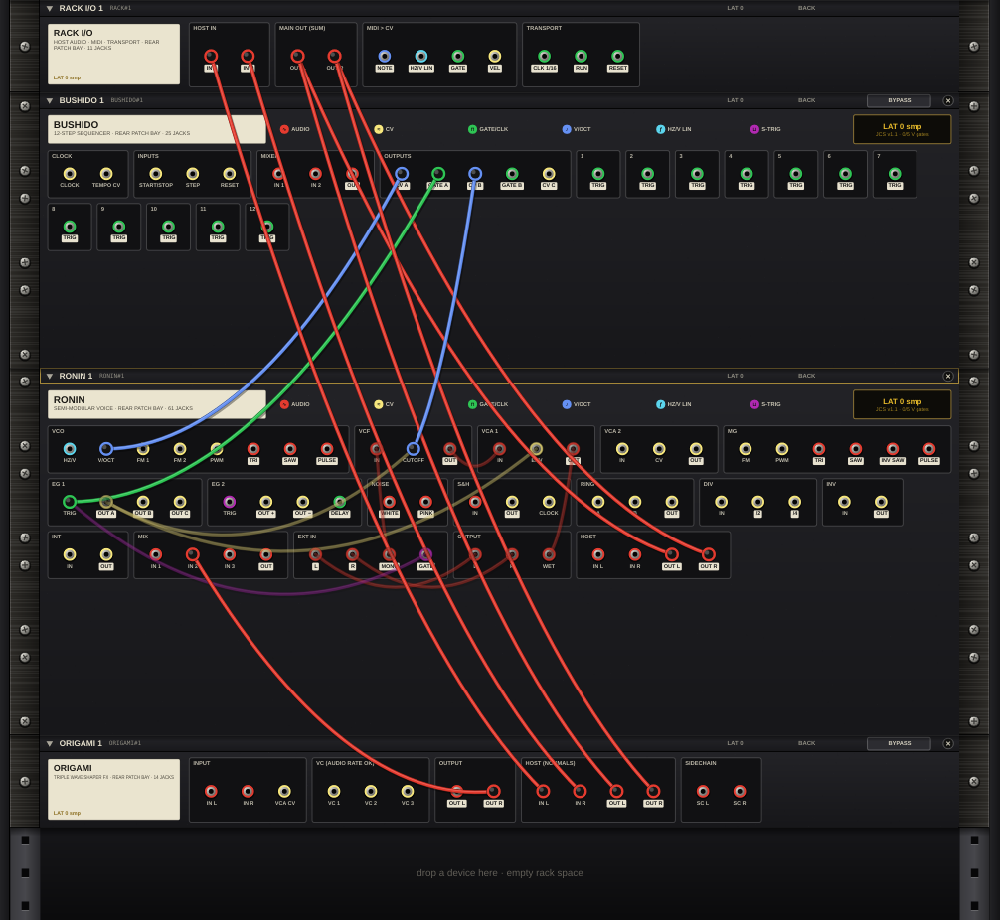

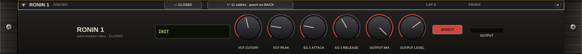

### What is different in the rack

- **Preset screen.** Bank **A** holds the 22 factory programs (section 6), and bank **B** your own saves. Loading a program sets RONIN's knobs and replaces the cables between RONIN's own jacks. Cables to other devices stay.
- **Timing.** RONIN runs at the rack's sample rate and reports 0 samples of latency.
- **Saved programs.** Bank B is stored on your computer and shared by every JIDAI RACK instance, in `user_presets.json`:

| System | Folder |
|---|---|
| Mac | `~/Library/RONIN/` |
| Windows | `%APPDATA%\RONIN\` |

### Back-only jacks

| Jack | Behaviour |
|---|---|
| HOST IN L, HOST IN R | Feed RONIN's EXT IN, the way host audio reaches the plugin. IN R follows IN L when only IN L is patched. |
| HOST OUT L, HOST OUT R | What RONIN's OUTPUT section sends to the host: its MIX of WET and the dry L and R signals. |

### Colours on the back

The rear jack rings use the same role colours as the plugin (section 4.4): red audio, blue V/OCT, light blue HZ/V, green gate and clock, yellow CV and purple S-trig. An output has a light label under the jack and an input a plain one. A gate patched into RONIN's EG TRIG inputs is converted to S-trig automatically.

### Automatic cables

When you add RONIN, the rack connects HOST OUT L/R to RACK I/O › MAIN OUT. Placed directly under a BUSHIDO, RONIN also gets BUSHIDO's row A pitch (CV A → V/OCT, or → HZ/V when row A uses the linear law) and gate (GATE A → EG 1 TRIG). **RONIN FX** is a RONIN that also takes the host audio (RACK I/O › HOST IN → RONIN › HOST IN), ready for the effect programs. Hold **Shift** while adding a device to skip the automatic cables.

### RONIN with BUSHIDO: the acid patch

BUSHIDO is the Jidai step sequencer. It plays RONIN's acid programs in place of RONIN's own MG pattern.

| From | To | Why |
|---|---|---|
| BUSHIDO › CV A (pitch) | RONIN › INT IN | Row A plays the notes. INT smooths each step into the next: that is the slide. |
| RONIN › INT OUT | RONIN › VCO V/OCT | The slid pitch drives the VCO. |
| BUSHIDO › GATE A | RONIN › EG 1 TRIG and EG 2 TRIG | Each step fires both envelopes: EG 1 opens VCA 1 and EG 2 snaps the filter. The gate is converted to S-trig. |
| BUSHIDO › CV C (accent) | RONIN › VCF CUTOFF | Row C is the accent. |
| RONIN › EG 2 OUT + | RONIN › VCF CUTOFF | The filter snap. It sums with the accent on the same jack (two cables on one input). |
| RONIN › EG 1 OUT A | RONIN › VCA 1 ENV | EG 1 opens the VCA (already in the acid programs). |
| RONIN › HOST OUT L/R | RACK I/O › MAIN OUT L/R | To your DAW. |

Tips:

- **Use the starter rack.** **RACKS ▾ › ACID › Acid Line** is this patch, ready to play on BUSHIDO's host clock.
- **Starting from an acid program instead.** The program brings its own MG PULSE cables into EG 1 TRIG and EG 2 TRIG, and its DIV, MIX and INV pattern into INT IN. Remove the MG PULSE cables so only BUSHIDO's gate fires the envelopes. BUSHIDO's pitch adds to the built-in pattern at INT IN; turn MIX LEVEL 1 and 2 to 0 to hear BUSHIDO's notes alone.
- **Octave.** BUSHIDO's pitch starts at C3 (0 V). For bass, set VCO RANGE to 16' (one octave lower) or 32' (two octaves lower). The acid programs use 16'.
- **Slide.** Turn INT TIME down for steps without slide, or up for a slower, rubbery slide.

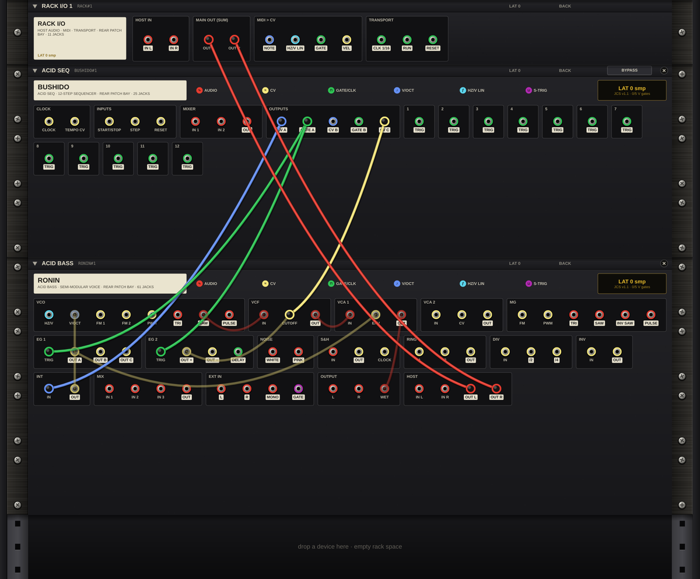

### RONIN with SHOGUN

SHOGUN is the Jidai drum machine. Drums and bass meet at MAIN OUT, and the rack lines them up to the sample.

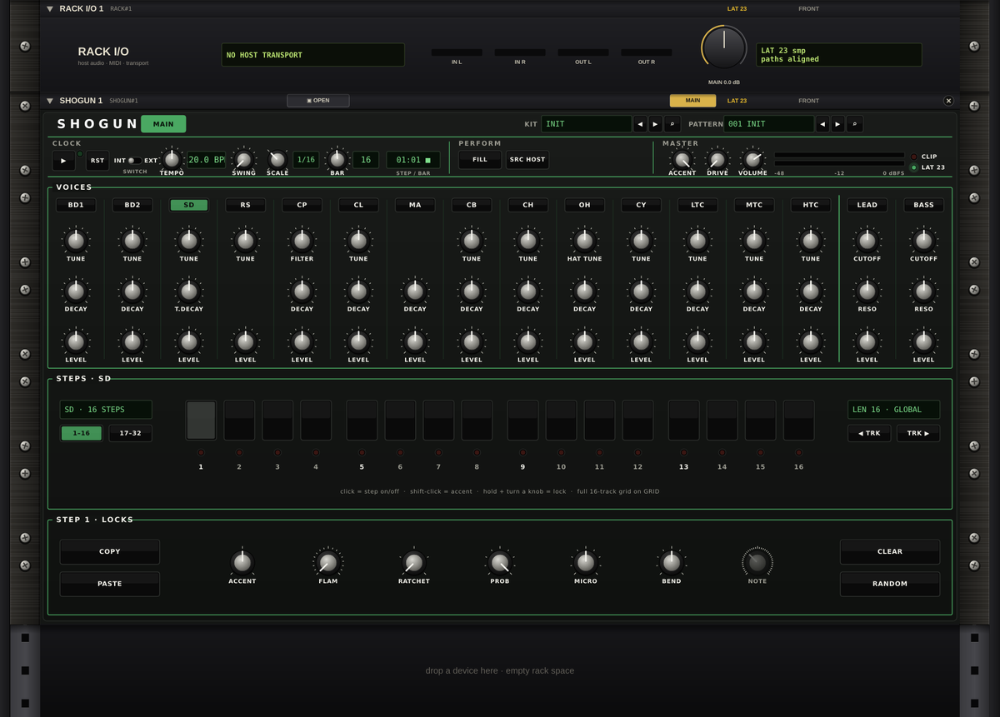

- **Acid Drum Jam** (**RACKS ▾ › EDM › Acid Drum Jam**): SHOGUN plays a four-on-the-floor kit clocked from RACK I/O › CLK 1/16 and RESET. A BUSHIDO acid line (wired as above) plays RONIN's ACID DRIVE sound through ORIGAMI. SHOGUN › MIX L/R and ORIGAMI › OUT L/R both go to MAIN OUT.
- **Full EDM Jam** (**RACKS ▾ › EDM › Full EDM Jam**): SHOGUN follows the host transport, its mix runs through ORIGAMI, and BUSHIDO's bass on RONIN joins at MAIN OUT.
- **Drums through RONIN.** Patch SHOGUN › MIX L/R (or one voice's OUT) into RONIN › HOST IN L/R. The drums then arrive at RONIN's EXT IN, ready for the effect programs such as 03 ENV FILTER or 06 S&H FILTER.
- **SHOGUN's clock on RONIN.** SHOGUN › CLOCK CLK OUT is a gate output. Patch it into RONIN › EG 1 TRIG, DIV IN or S&H CLOCK to step RONIN in time with the drums.

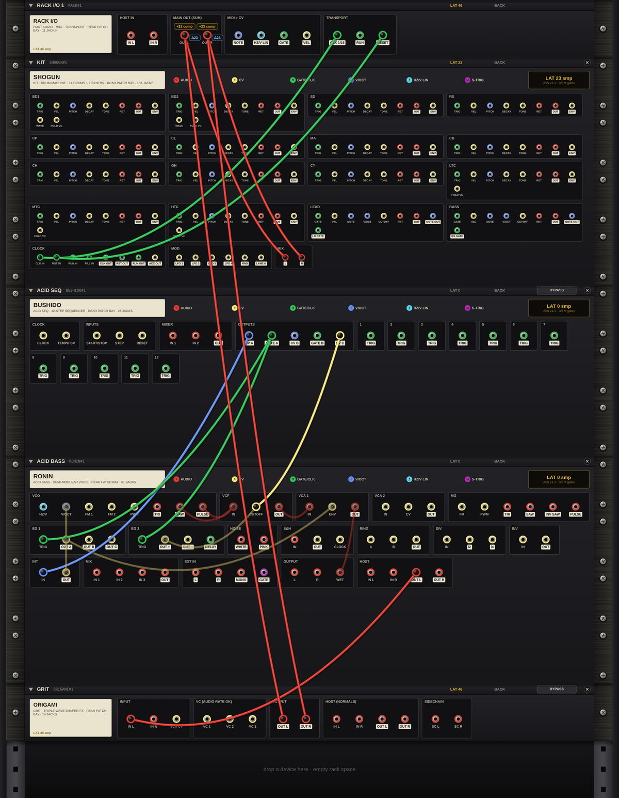

### RONIN with ORIGAMI

ORIGAMI is the Jidai wave folder. RONIN's voice through ORIGAMI turns a plain bass or filter sweep into dense harmonics.

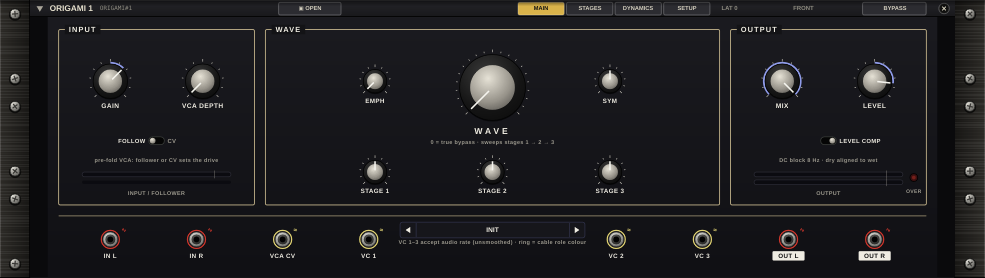

- **Voice into the folder.** RONIN › HOST OUT L → ORIGAMI › IN L (ORIGAMI's IN R follows IN L), then ORIGAMI › OUT L/R → MAIN OUT.
- **Envelope on the fold.** In the **Acid Fold** starter rack, RONIN › EG 2 OUT + also drives ORIGAMI › VC 1, so the filter snap folds harder at the same time.
- **Effects on your track.** **Filter Fold FX** runs your track through RONIN's MG-swept filter, then ORIGAMI. **Tempo Gate FX** chops your track in time: RACK I/O › HOST IN L/R → RONIN › HOST IN L/R, RACK I/O › CLK 1/16 → RONIN › EG 1 TRIG, and EG 1 OUT A opens VCA 1. RONIN's HOST OUT runs through ORIGAMI to MAIN OUT.

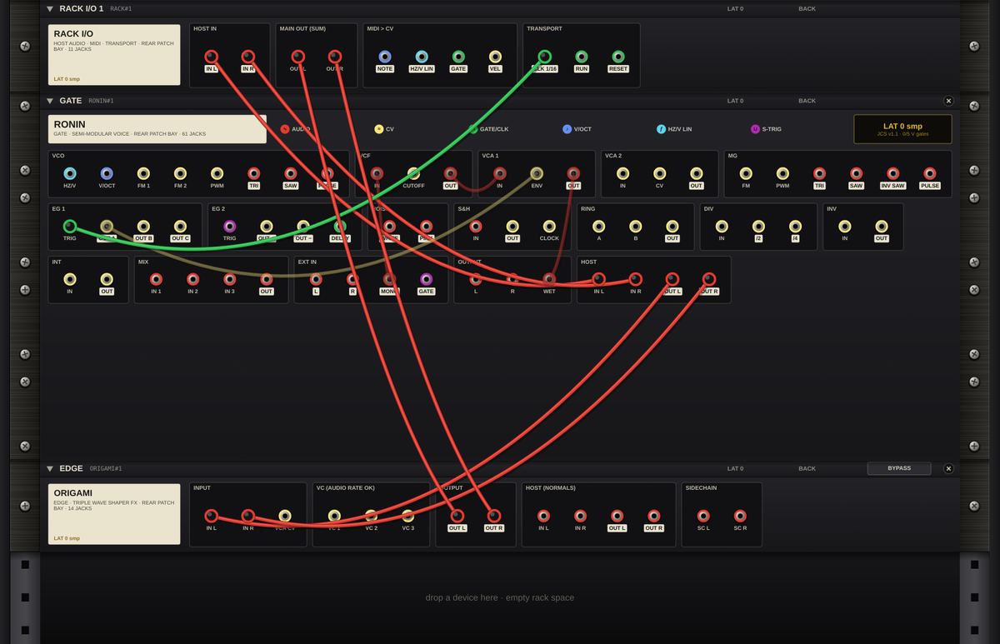

### Playing RONIN from MIDI

**MIDI Fold Synth** (**RACKS ▾ › EDM › MIDI Fold Synth**) plays RONIN from your keyboard: RACK I/O › NOTE → RONIN › V/OCT, GATE → EG 1 TRIG, and VEL → RONIN › MIX IN 2, where it adds to the envelope on the filter, so harder notes are brighter. RONIN's HOST OUT goes through ORIGAMI to MAIN OUT. For RONIN's HZ/V input, use RACK I/O › HZ/V LIN instead of NOTE.

### Starter racks with RONIN

| Group | Rack | Devices |
|---|---|---|
| ACID | Acid Line | BUSHIDO, RONIN |
| ACID | Acid Fold | BUSHIDO, RONIN, ORIGAMI |
| EDM | Driving Bass | BUSHIDO, RONIN, ORIGAMI |
| EDM | Pluck Lead | BUSHIDO, RONIN, ORIGAMI |
| EDM | Two Voices | BUSHIDO, 2 × RONIN, ORIGAMI |
| EDM | Stepped Fold | BUSHIDO, RONIN, ORIGAMI |
| EDM | MIDI Fold Synth | RONIN, ORIGAMI |
| EDM | Acid Drum Jam | SHOGUN, BUSHIDO, RONIN, ORIGAMI |
| EDM | Full EDM Jam | SHOGUN, BUSHIDO, RONIN, ORIGAMI |
| FX | Filter Fold FX | RONIN, ORIGAMI |
| FX | Tempo Gate FX | RONIN, ORIGAMI |
